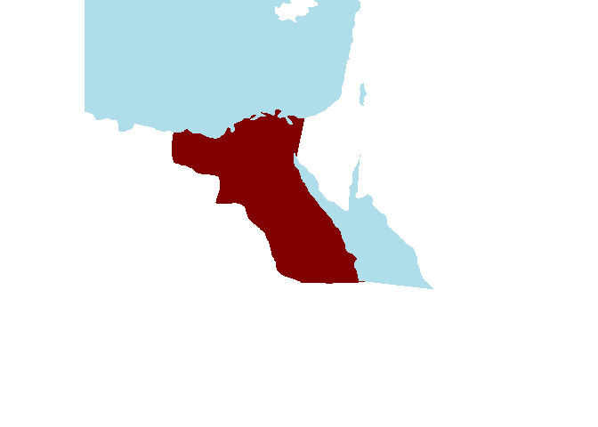
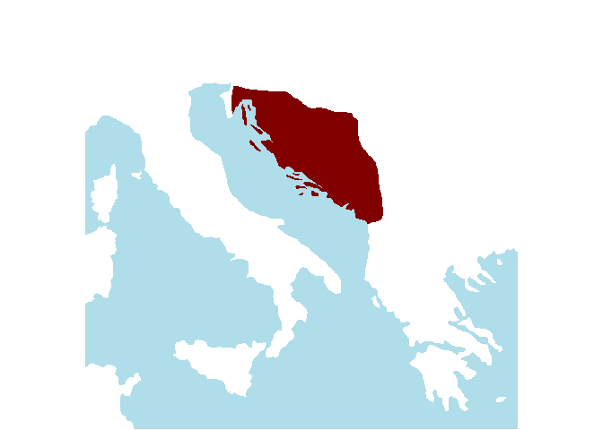

<!--
---
title: Updating the 'EDH' dataset
subtitle: Digital Literacy 2020--2021 project&nbsp;&nbsp;&nbsp;(Task 2)
date: "19 marts 2021"
#date:  "12 March 2021" 
author: 
  - name: "Antonio Rivero Ostoic"
    affiliation: <center>Sch Culture & Soc, Aarhus University</center>
    email: <center>jaro@cas.au.dk</center>
output:
  html_document:
    theme: united
    highlight: tango
    code_folding: none
    keep_md: true
  pdf_document: default
---

<style type="text/css">
h1, h4 {
  color: DarkRed;
}
h1.title {
  font-size: 24pt;
  text-align: center;
}
h3.subtitle {
  font-size: 12pt;
  text-align: center;
  padding-bottom: 40px;
}
h2 {
  font-size: 22pt;
}
h3 {
  font-size: 18pt;
}
h4.author, h4.date {
  text-align: center;
}

p.output {
background-color: #FFFFFF;
padding: 10px;
border: 1px solid #C0C0C0;
margin-left: 0px;
border-radius: 5px;
font-family: monospace;
font-size: 11pt;
font-weight:bold;
}

div.see {
background-color: #99FFFF;
padding: 0px;
padding-left: 20px;
border: 1px solid #FFFFCC;
margin: 60px;
margin-right: 240px;
border-radius: 5px;
}

</style>

-->


# Updating the 'EDH' dataset

## Digital Literacy 2020--2021 project   (Task 2)

<div style="margin-bottom:60px;"> </div>

<br />

### Preliminaries
`"sdam"` is an `R` package that provides tools for performing analyses within Social Dynamics and complexity in the
Ancient Mediterranean [SDAM](https://sdam-au.github.io/sdam-au/), which is a research group based at CEDHAR, Aarhus University. 
Package `"sdam"` allows accessing and manipulating data from the Epigraphic Database Heidelberg API, performing HTTP requests, 
visualizing interval time events, compute probabilities of existence of archaeological assemblages and artifacts, and 
produce similarity matrices by simple matching between these objects. 


```r
# install beta version from Github
devtools::install_github("mplex/cedhar", subdir="pkg/sdam")
```

<div style="margin-bottom:15px;"> </div>


```r
# load package and check version
library("sdam")
packageVersion("sdam")
```

```
[1] '0.4.6'
```


<div style="margin-bottom:60px;"> </div>


#### `"sdam"` datasets
Package `"sdam"` comes with a suite of datasets related to the Roman Empire.


```r
data(package="sdam")
```
```
Datasets in package `sdam´:

EDH                                                 Epigraphic Database Heidelberg Dataset
rp                                                  Roman province names and acronyms as in EDH
rpmp                                                Maps of ancient Roman provinces and Italian regions
rpmcd                                               Caption maps and affiliation dates of Roman provinces
```
<div style="margin-bottom:30px;"> </div>
For instance, the acronym names of ancient Roman provinces found in the `EDH` dataset are recorded in `"rp"`. 


<div style="margin-bottom:60px;"> </div>


### EDH dataset

<div style="margin-bottom:30px;"> </div>

#### By province
`EDH` is a dataset that contains the texts of Latin and Latin-Greek inscriptions from the Roman Empire, which have 
been retrieved from the [Epigraphic Database Heidelberg API repository](https://edh-www.adw.uni-heidelberg.de/data/api). 
The requests to the server has been made by using functions `get.edh()` and `get.edhw()` from `"sdam"`. 
For instance, to retrieve inscriptions from *Aegyptus* in the API repository we use its acronym in the `province` 
argument from `get.edh()` and we get a list object with the records from this province. 


```r
get.edh(province="Aeg")
```

<div class="figure" style="text-align: center">

<p class="caption">Roman province of Aegyptus (117 AD)</p>
</div>


<div style="margin-bottom:30px;"> </div>


However, there are some restrictions in the Epigraphic Database Heidelberg API repository for data to retrieve and 
for the ancient Roman province of *Dalmatia*, for example, we may get an error message.


```r
get.edh(province="Dal")
```
```
Error in file(con, "r") : cannot open the connection
In addition: Warning messages:
1: In get.edh(province = "Dal") :
  Total number of records is 7646 and only 4000 records are returned.
Use offset = 4000 to complete the query, or set maxlimit = 7646
2: In file(con, "r") :
  InternetOpenUrl failed: 'Der opstod timeout i handlingen.'
```

<div class="figure" style="text-align: center">

<p class="caption">Roman province of Dalmatia (117 AD)</p>
</div>


<div style="margin-bottom:30px;"> </div>


To avoid a timeout from the server side  and obtain the 7646 records for this province, we may need to split the query 
into two parts, one that ends in 4000 and the other one that starts from this number.


```r
get.edh(province="Dal", maxlimit=4000)
get.edh(province="Dal", offset=4000)
```

<div style="margin-bottom:30px;"> </div>

#### EDH by HD number
Another option is retrieving the records by their Heidelberg Database `id` rather than by province. 
In the following example, we use the wrapper function `get.edhw()` to obtain the first 4000 records from the 
entire database.


```r
get.edhw(hd_nr=1:4000)
```

<div style="margin-bottom:30px;"> </div>

The `EDH` dataset in `"sdam"` has been built **until 10-11-2020** in this way.


<div style="margin-bottom:30px;"> </div>


<br/>

More details in [sdam" manual](https://github.com/mplex/cedhar/blob/master/typesetting/reports/sdam.pdf)

<br/>


<div style="margin-bottom:90px;"> </div>


### Updating `EDH` dataset
The purpose of having one `EDH` dataset within the `"sdam"` package is to facilitate data wrangling for the analysis. 
For instance, the wrapper function `edhw()` allows extracting specific information from `EDH` (if no other input data is 
specified) and transforming it into a data frame object. 


<br/>

TODO: Example with function `edhw()`

<br/>


<div style="margin-bottom:30px;"> </div>


#### Last updating
Each record from the API database has different components including a timestamp of the last update. 
For example, the last update of the first record in the API database is


```r
get.edhw(hd_nr="1")$last_update
```
```
[1] "2014-04-07"
```

<div style="margin-bottom:30px;"> </div>

while for this other record the last update is after the `EDH` dataset was created, which is last year. 


```r
get.edhw(hd_nr="79384")$last_update
```
```
[1] "2021-02-05"
```

<div style="margin-bottom:60px;"> </div>

The purpose of this task is to update the `EDH` dataset, and one possibility is as follows


```r
# load province acronyms as in EDH
data("rp")
# create a list object size 'rp'
update <- vector("list", length=length(rp))
names(update)<-names(rp)
# retrive data for each province
for(k in seq_len(length(names(rp)))) {
tmp <- get.edh(province=names(rp)[k], addID=FALSE)
if(is.null(tmp)==FALSE) {
	tmpu <- unlist(lapply(lapply(tmp, function(x) c(x$id, x$last_update))[which(unlist(lapply(lapply(tmp, 
		function(x) c(x$id, x$last_update)), 
		function(y) (y[2] > as.Date("2020-11-10")))))], 
		function(z) (z[1])))
	if(is.null(tmpu)==FALSE) {
	update[[k]] <- tmpu
	} else {
	NA
	}
} else { 
	NA
}
}; rm(k)
```

<div style="margin-bottom:30px;"> </div>

However, this will produces errors for provinces that have many records  as we saw for `"Dal"` above. 
To avoid this, we could use arguments `maxlimit` and `offset` from `get.edh()` and combine these outputs.


<div style="margin-bottom:60px;"> </div>

Another possiblity is to build the `EDH` dataset again from scratch and avoid dealing with timeout errors 
in some provinces.


```r
# total inscriptions as 18-03-2021
EDH <- get.edhw(hd_nr=1:81790)
```

<div style="margin-bottom:60px;"> </div>

#### DeiC's UCloud?
These two options take, however, very long time, and running the script on [DeiC's UCloud](https://cloud.sdu.dk/app/login) 
servers seems to help solving this issue.

<div style="margin-bottom:30px;"> </div>

<!-- Help wanted 😄 -->


<div style="margin-bottom:60px;"> </div>


##### See also

* [Re-encoding Greek characters from 'EDH' dataset](https://sdam-au.github.io/sdam/articles/Encoding.html)
* [Plotting ancient Roman provinces and regions](https://sdam-au.github.io/sdam/articles/RomanProvs.html)
<!-- * [R package `"sdam"`](https://sdam-au.github.io/sdam/)
* [Social Dynamics and complexity in the Ancient Mediterranean Project](https://sdam-au.github.io/sdam-au/) -->


<div style="margin-bottom:60px;"> </div>


